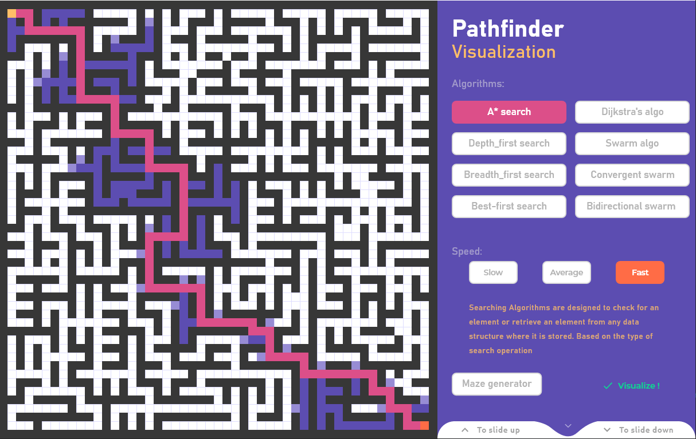
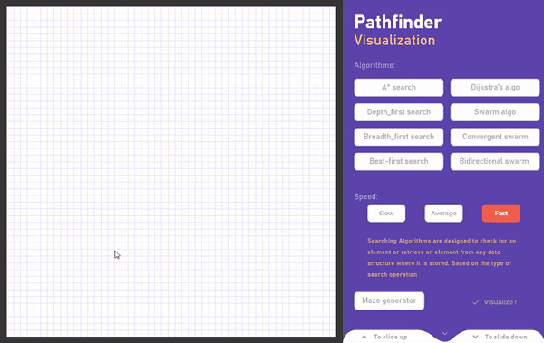
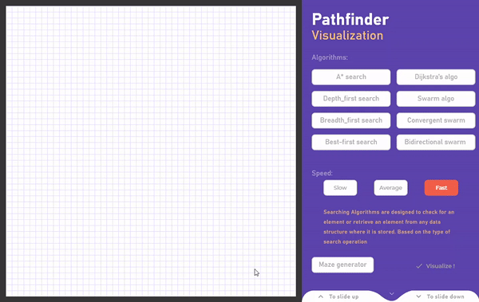

# Python-pathfinder-GUI
A pathfinding visualizer in python with a user interface made using pygame. 

# Description

## requirements:

if you want to run the source code avaible in this repository , make sure you have:

* pygame `pip install pygame`

## Global view

When executing the `main.py` file , the app will look like this :

**Select** :
- your pathfinding algo
- the speed of visualization 
- put your starting and ending points wherever you want
- press `s` to start and `c` to clear !

You can access the notice manipulating the `DOWN` and `UP` buttons.

You can also **randomly generate mazes** !!!

## HAVE FUN !!!
contact me : kiatdotblend@gmail.com
